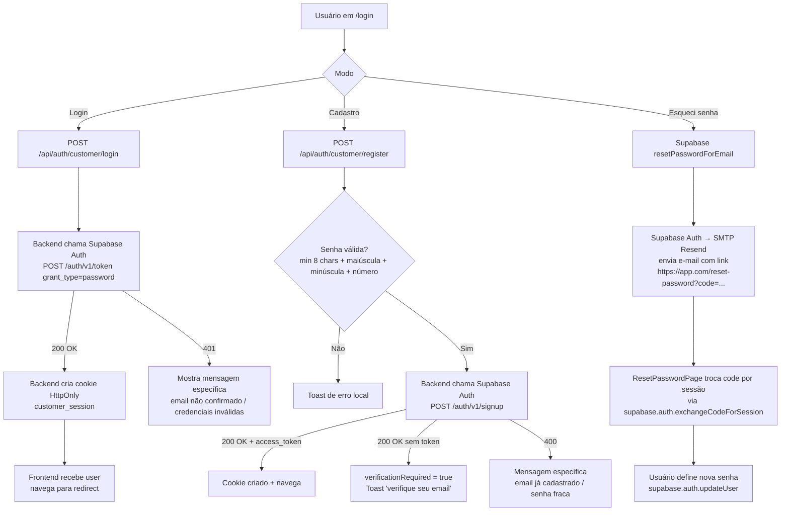
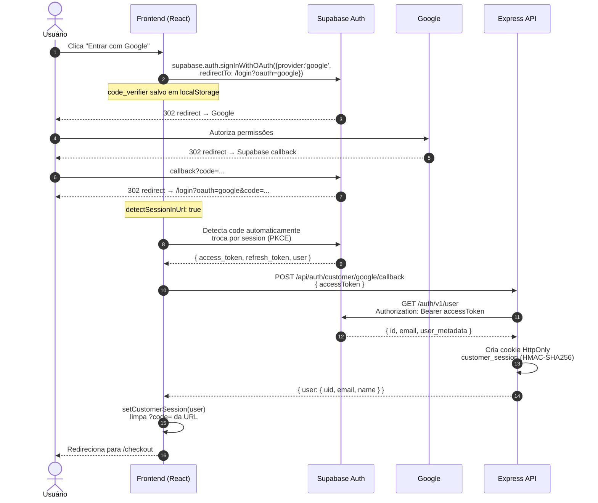
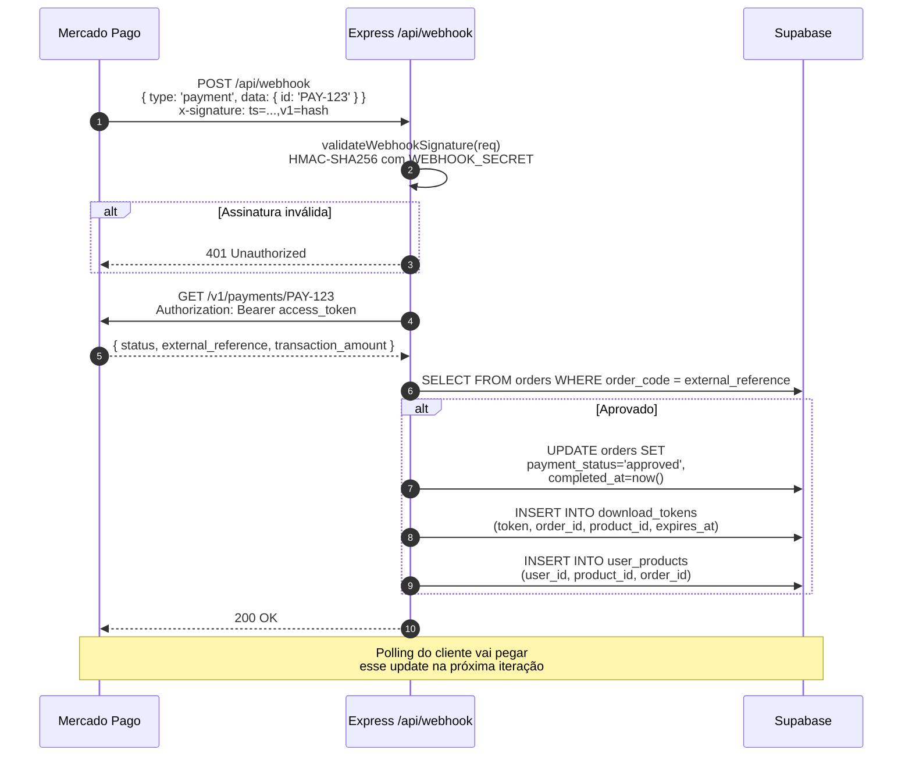
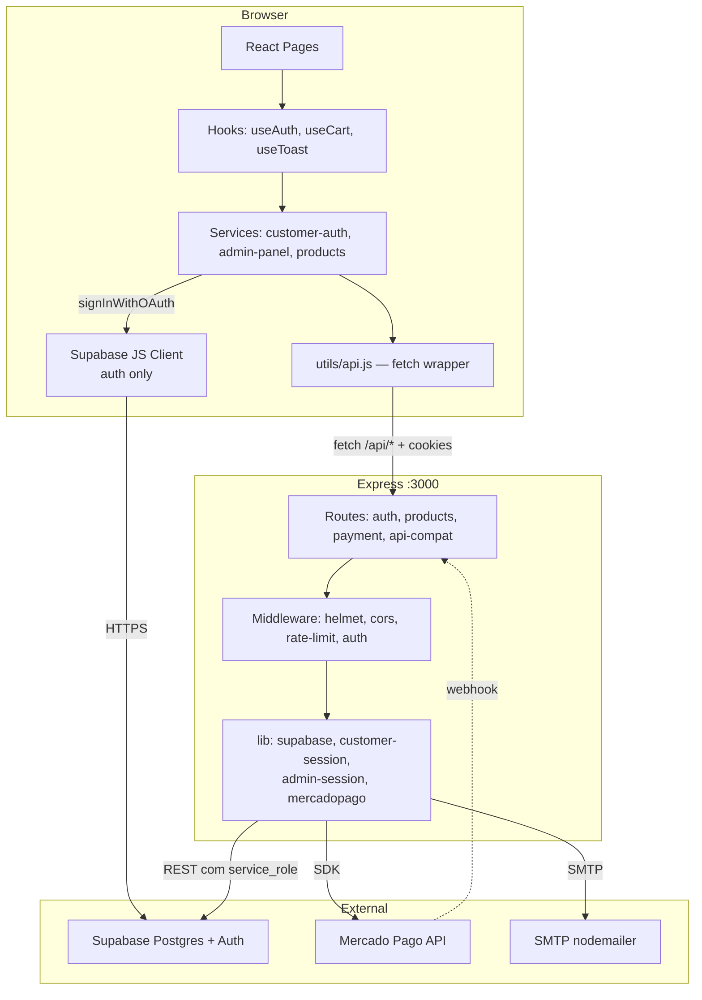

# Fluxogramas

> Diagramas em **Mermaid**. Abra este arquivo no GitHub, VS Code (com extensão Mermaid Preview) ou em https://mermaid.live.

## Índice

- [1. Login / cadastro de cliente](#1-login--cadastro-de-cliente)
- [2. Login Google OAuth (PKCE)](#2-login-google-oauth-pkce)
- [3. Compra e download](#3-compra-e-download)
- [4. Admin: criar/editar produto](#4-admin-criareditar-produto)
- [5. Webhook Mercado Pago](#5-webhook-mercado-pago)
- [6. Estrutura geral de chamadas](#6-estrutura-geral-de-chamadas)

---

## 1. Login / cadastro de cliente



**Pré-requisitos para o reset funcionar:**
- SMTP custom configurado no Supabase Auth (sem isso, usa SMTP grátis que só entrega pra members da org)
- Em sandbox do Resend, só entrega para o e-mail dono da conta Resend
- Em produção: domínio verificado em [resend.com/domains](https://resend.com/domains) + `smtp_admin_email` apontando pra ele

**Link "· admin ·":** no rodapé do `/login`, link discreto leva pra `/painel-acesso-privado-atelie`. Conveniência pra admin não ter que decorar a URL obscurecida.

---

## 2. Login Google OAuth (PKCE)



**Pontos críticos:**
- O Supabase Client é **único responsável** pelo OAuth — não fazemos a request pro Google manualmente.
- A `redirectTo` precisa estar no `uri_allow_list` do Supabase (scripts/configure-auth.js cuida disso).
- O cookie HttpOnly do nosso backend é **separado** da sessão do Supabase Client. Os dois coexistem.

---

## 3. Compra e download

```mermaid
flowchart TD
    A[Cliente adiciona ao carrinho<br/>localStorage] --> B[/checkout/]
    B --> C[Preenche nome + email]
    C --> D[POST /api/create-payment<br/>{ items, customer }]

    D --> D1[Backend valida produtos<br/>SELECT FROM products WHERE id IN ...]
    D1 --> D2[INSERT INTO orders + order_items<br/>status=pending]
    D2 --> D3[Cria preferência Mercado Pago<br/>com items + back_urls + webhook]
    D3 --> D4[UPDATE orders SET preference_id]
    D4 --> D5{Retorna initPoint para o frontend}

    D5 --> E[Frontend abre Mercado Pago<br/>em nova aba via window.open]
    D5 --> F[Salva pendingOrderId no state<br/>useEffect inicia polling]

    F --> F1[A cada 4s GET /api/verify-payment?orderId=X]
    F1 --> F2{paymentStatus?}
    F2 -->|approved| G[Limpa carrinho<br/>navega para /downloads]
    F2 -->|rejected/cancelled| H[Toast erro<br/>polling para]
    F2 -->|pending| F1
    F2 -->|150x sem resposta| I[Timeout 10min<br/>usuário pode verificar em Downloads]

    G --> J[/downloads?order=X/]
    J --> J1[GET /api/verify-payment?orderId=X]
    J1 --> J2{Status approved?}
    J2 -->|Sim| K[Lista download_tokens]
    J2 -->|Não| L[Continua polling a cada 10s<br/>até max 12 tentativas]

    K --> M[Para cada arquivo:<br/>href = /api/download?token=Y]
    M --> N[Backend valida token<br/>Faz pipe do arquivo Storage→browser]
    N --> O[INSERT INTO download_logs<br/>marca token como used]

    G -.->|paralelo| P[POST /api/send-confirmation-email<br/>nodemailer → Resend]
    P --> Q[Email transacional<br/>'Pagamento confirmado']
```

**Webhook paralelo:** ver fluxo #5. Polling cobre o caso de webhook não chegar (dev sem ngrok).

**Email de confirmação:** se `SMTP_HOST/USER/PASS` não estiverem no `.env.local`, o backend loga warning e segue (não falha checkout). Em produção, configure Resend (ver `docs/SETUP.md`).

---

## 4. Admin: criar/editar produto

```mermaid
flowchart LR
    A[Admin em /admin] --> B[Tab Produtos]
    B --> C[Clica 'Novo produto'<br/>OU 'Editar' em existente]
    C --> D[ProductWizard abre]

    D --> D1[Step 1: Básico<br/>nome + categoria + descrição]
    D1 --> D2[Step 2: Mídia<br/>multi-images + multi-videos + downloadUrl]
    D2 --> D3[Step 3: Preço<br/>price + originalPrice + type]
    D3 --> E[Submit do form]

    E --> F[AdminPage.handleProductSave<br/>monta payload com images[] e videos[]]
    F --> G{Tem ID?}
    G -->|Sim| H[PUT /api/admin-products<br/>updateProduct]
    G -->|Não| I[POST /api/admin-products<br/>createProduct]

    H --> J[Backend valida sessão admin<br/>ensureAdminSession]
    I --> J
    J --> K[toProductPayload normaliza<br/>image_url = images[0]<br/>images: jsonb array<br/>videos: jsonb array]
    K --> L[INSERT/UPDATE em public.products]
    L --> M[Refresh dashboard<br/>fechar wizard<br/>toast sucesso]
```

---

## 5. Webhook Mercado Pago



**Em dev sem ngrok**: webhook nunca chega → polling no frontend cobre o gap.

---

## 6. Estrutura geral de chamadas



**Observações:**
- O **Express é BFF** (Backend for Frontend): browser não fala direto com Supabase para dados (só Auth).
- **Service role nunca sai do servidor** — fica em variáveis de env do backend.
- **`utils/api.js`** centraliza fetch, timeout (15s) e parsing de erro.
- **Supabase JS Client no browser**: usado APENAS para `signInWithOAuth`, `signOut`, `getSession`, `updateUser` (reset de senha), `exchangeCodeForSession`. Toda CRUD em tabelas vai via backend.
