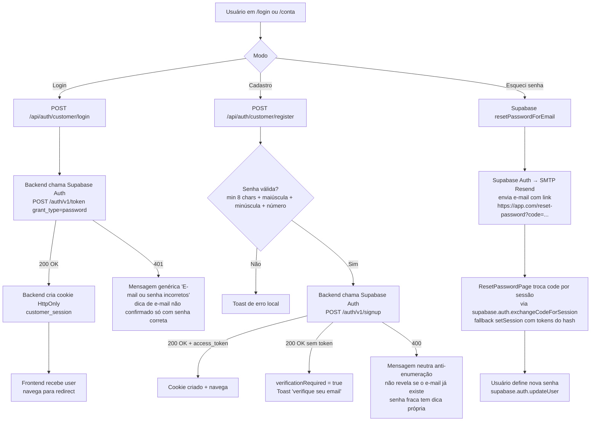
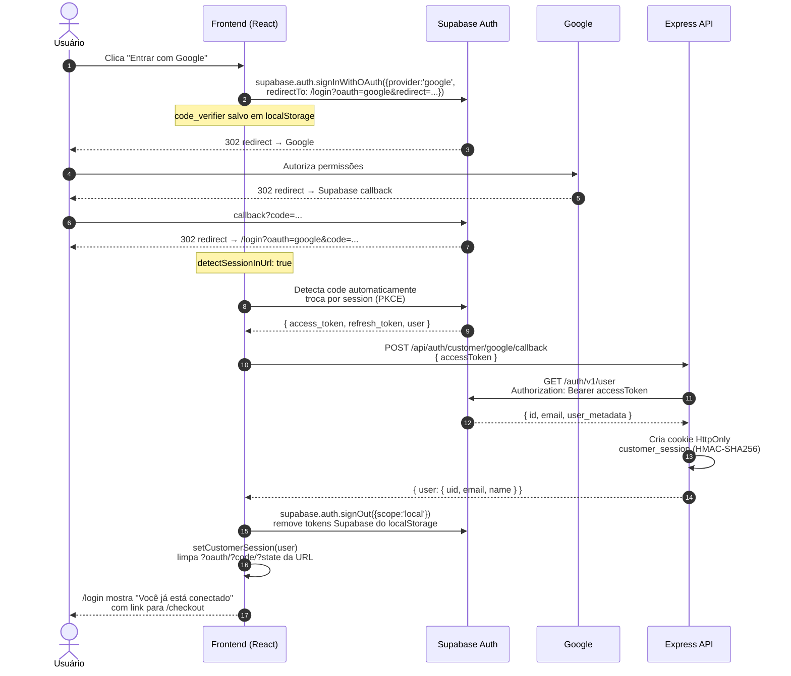
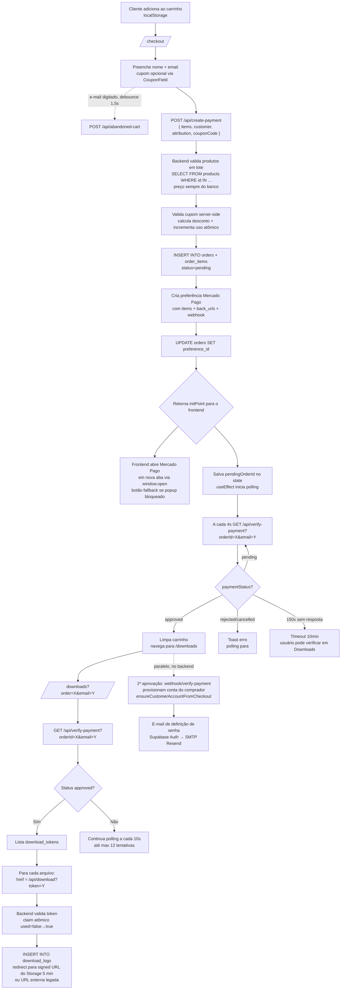
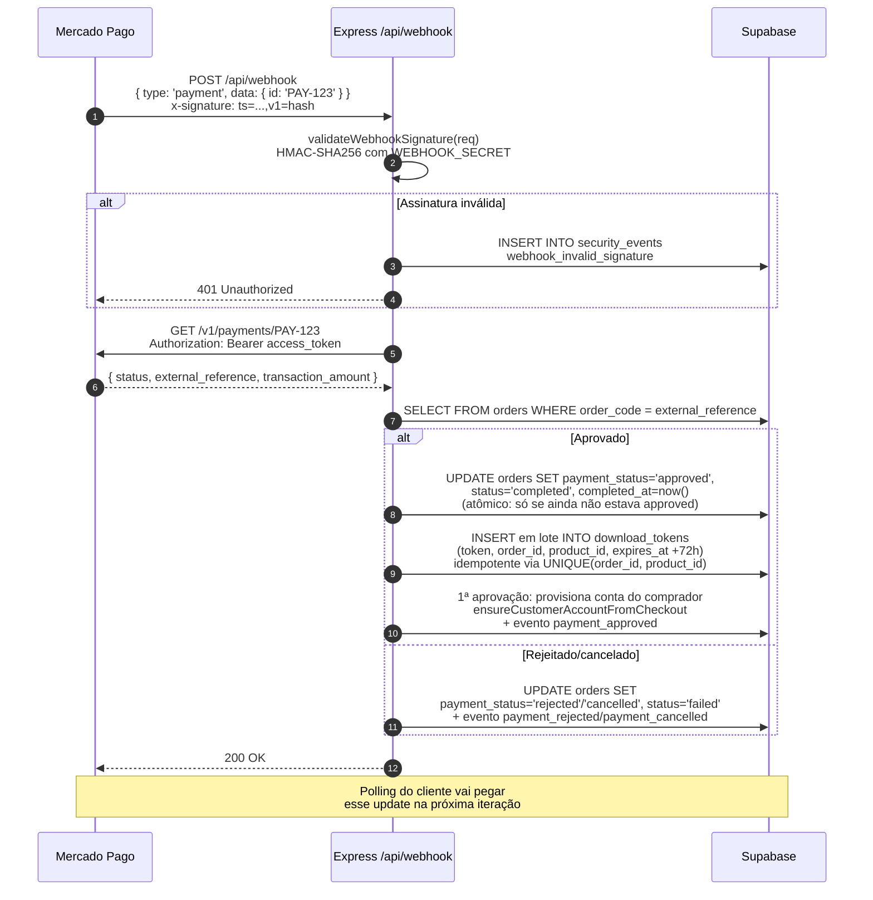
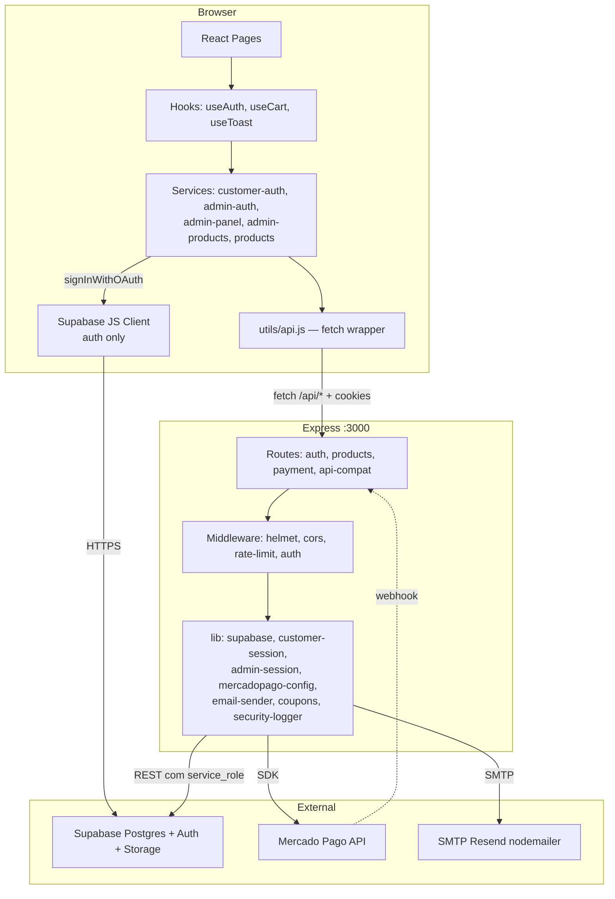

# Fluxogramas

> ## ⚠️ Documento em retirada
>
> **A versão canônica de fluxos é [ProjectDocs/05-FLUXOS.md](./ProjectDocs/05-FLUXOS.md).**
>
> Regra F2 (`CONTRIBUTING.md`): cada tema tem exatamente um arquivo canônico.
> Este arquivo é a versão curta de um par duplicado — as duas descrevem o mesmo
> assunto, com estruturas diferentes, e nada garante que estejam de acordo.
>
> **Não edite este arquivo.** Correção vai na versão canônica.
>
> Ele não foi apagado ainda porque os diagramas Mermaid daqui não têm equivalente óbvio na versão canônica. A remoção depende de alguém que
> conheça o estado atual do sistema confirmar, seção a seção, que a versão
> canônica cobre tudo o que está aqui.

> Diagramas em **Mermaid**. Abra este arquivo no GitHub, VS Code (com extensão Mermaid Preview) ou em https://mermaid.live.

## Índice

- [1. Login / cadastro de cliente](#1-login--cadastro-de-cliente)
- [2. Login Google OAuth (PKCE)](#2-login-google-oauth-pkce)
- [3. Compra e download](#3-compra-e-download)
- [4. Admin: criar/editar produto](#4-admin-criareditar-produto)
- [5. Webhook Mercado Pago](#5-webhook-mercado-pago)
- [6. Estrutura geral de chamadas](#6-estrutura-geral-de-chamadas)

---

## 1. Login / cadastro de cliente

**Pré-requisitos para o reset funcionar:**

- SMTP custom configurado no Supabase Auth (sem isso, usa SMTP grátis que só entrega pra members da org)
- Em sandbox do Resend, só entrega para o e-mail dono da conta Resend
- Em produção: domínio verificado em [resend.com/domains](https://resend.com/domains) + `smtp_admin_email` apontando pra ele

**Rota do admin:** o login do painel fica no caminho ofuscado `/painel-acesso-privado-atelie` (constante `ADMIN_LOGIN_PATH` em `src/constants/routes.js`); a rota `/admin-login` apenas redireciona para ele. Não há link para o painel no `/login` da loja.

---

## 2. Login Google OAuth (PKCE)

**Pontos críticos:**

- O Supabase Client é **único responsável** pelo OAuth — não fazemos a request pro Google manualmente.
- A `redirectTo` precisa estar no `uri_allow_list` do Supabase (scripts/configure-auth.js cuida disso).
- Depois que o cookie HttpOnly do backend é criado, o frontend faz `signOut({ scope: 'local' })` — os tokens do Supabase saem do localStorage (menos superfície pra XSS). A sessão passa a viver **só** no cookie.

---

## 3. Compra e download

**Webhook paralelo:** ver fluxo #5. O polling não depende do webhook: `verify-payment` consulta o Mercado Pago diretamente (`Payment.search`) e, se o pagamento aprovou, faz a mesma transição do pedido + criação de tokens (cobre dev sem ngrok).

**Email de confirmação do pedido:** `POST /api/send-confirmation-email` existe como endpoint idempotente de (re)envio (`email_sent_log`; destinatário é sempre o e-mail gravado no pedido) — não é disparado automaticamente pelo SPA. Se `SMTP_HOST/USER/PASS` não estiverem no `.env.local`, o backend loga warning e segue (não falha checkout). Em produção, configure Resend (ver `docs/SETUP.md`).

---

## 4. Admin: criar/editar produto

```mermaid
flowchart LR
    A[Admin em /admin] --> B[Tab Produtos]
    B --> C[Clica 'Novo produto'<br/>OU 'Editar' em existente]
    C --> D[ProductWizard abre]

    D --> D1[Step 1: Básico<br/>nome + categoria + descrição]
    D1 --> D2[Step 2: Mídia<br/>multi-images + multi-videos + downloadUrl<br/>upload via signed URL do Storage]
    D2 --> D3[Step 3: Preço & Variações<br/>price + originalPrice + type]
    D3 --> D4[Step 4: Conversão<br/>benefits + FAQ + reviews]
    D4 --> E[Submit do form]

    E --> F["AdminPage.handleProductSave<br/>monta payload com images[], videos[],<br/>faq, reviews e benefits"]
    F --> G{Tem ID?}
    G -->|Sim| H[PUT /api/admin-products<br/>updateProduct]
    G -->|Não| I[POST /api/admin-products<br/>createProduct]

    H --> J[Backend valida sessão admin<br/>ensureAdminSession + same-origin em escrita]
    I --> J
    J --> K["toProductPayload normaliza<br/>image_url = images[0]<br/>images: jsonb array<br/>videos: jsonb array"]
    K --> L[INSERT/UPDATE em public.products<br/>+ audit em admin_audit_log]
    L --> M[Refresh dashboard<br/>fechar wizard<br/>toast sucesso]
```

**Upload de mídia:** o wizard pede uma signed upload URL ao backend (`POST /api/admin-upload-url`, com whitelist de extensão/MIME) e faz o PUT via XHR **direto no Supabase Storage** — limites de 10MB para imagem e 50MB para vídeo/arquivo de download.

---

## 5. Webhook Mercado Pago

**Em dev sem ngrok**: webhook nunca chega → polling no frontend cobre o gap (`verify-payment` consulta o MP e cria os tokens sozinho).

---

## 6. Estrutura geral de chamadas

**Observações:**

- O **Express é BFF** (Backend for Frontend): browser não fala direto com Supabase para dados (exceções: Auth e o upload de mídia do admin, feito por PUT em signed URL do Storage).
- **Service role nunca sai do servidor** — fica em variáveis de env do backend.
- **`utils/api.js`** centraliza fetch, timeout (15s) e parsing de erro.
- **Supabase JS Client no browser**: usado APENAS para `signInWithOAuth`, `signOut`, `getSession`, `resetPasswordForEmail`, `exchangeCodeForSession`/`setSession` e `updateUser` (reset de senha). Toda CRUD em tabelas vai via backend.
- **Em produção (Vercel)** o Express não roda: cada arquivo de `api/` vira função serverless com a mesma rota; `routes/api-compat.routes.js` garante a paridade dev↔prod.
