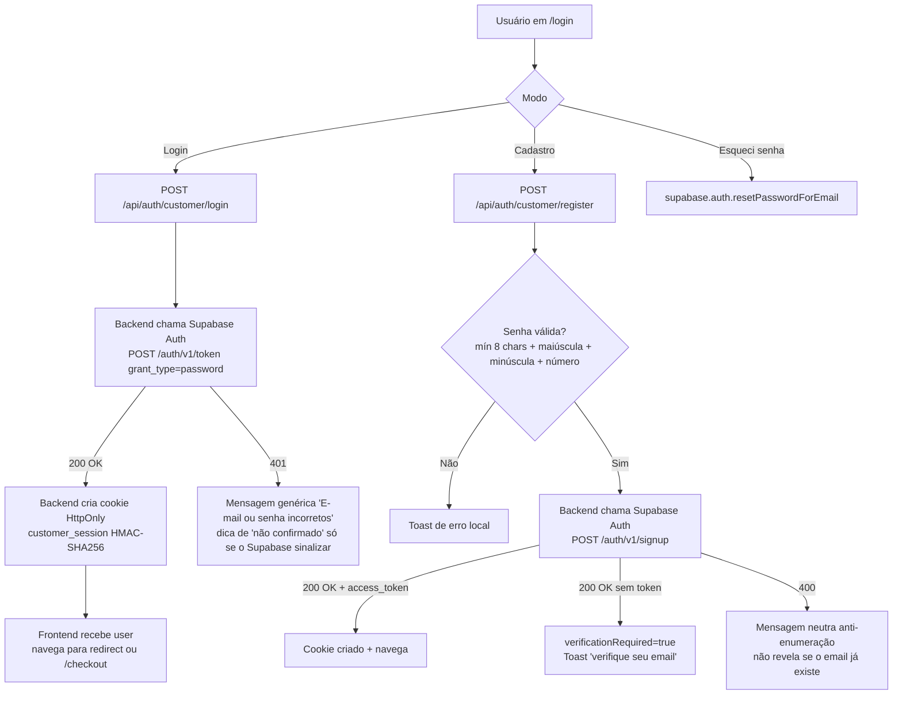
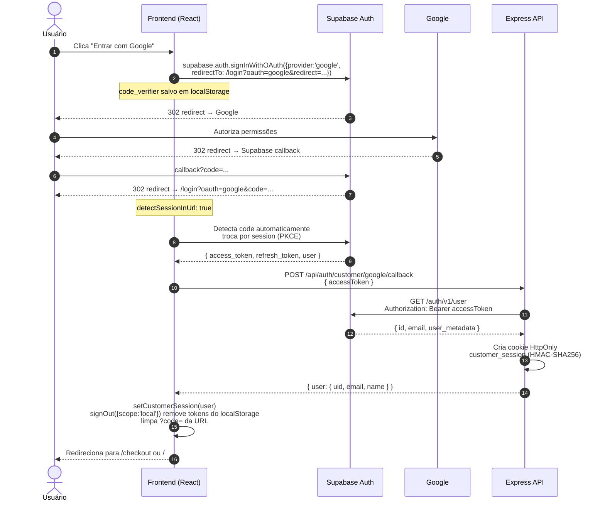
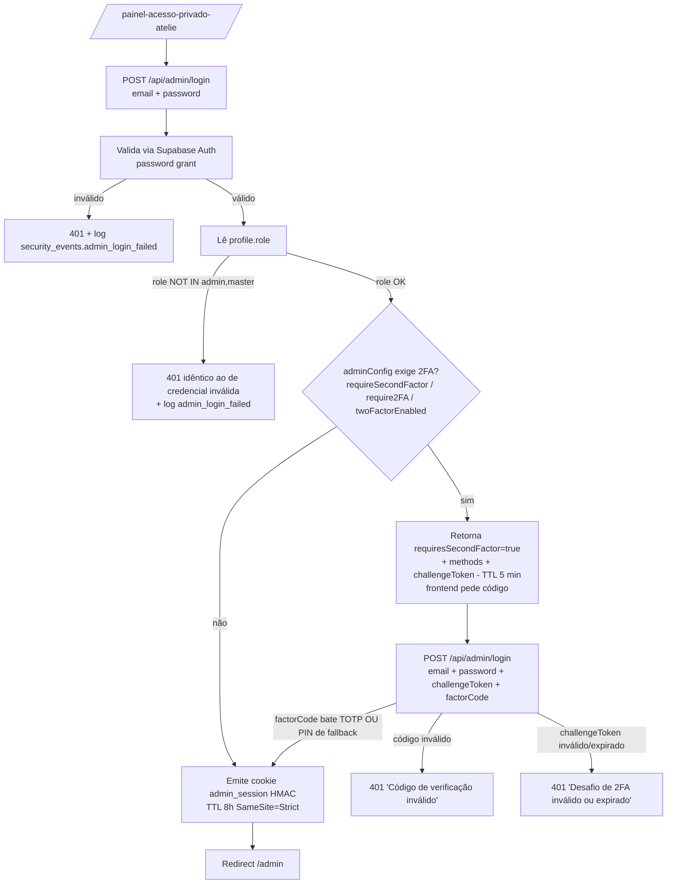
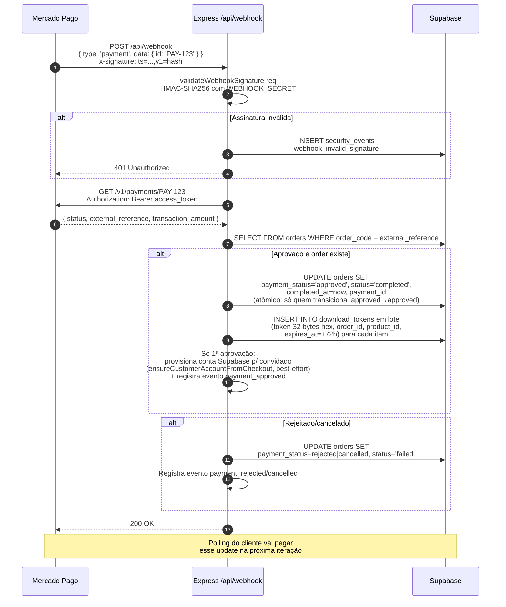
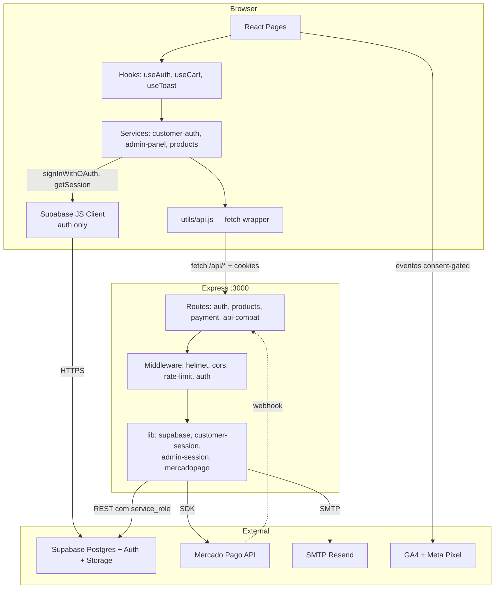

# 05 — Fluxos (diagramas)

> Diagramas em **Mermaid**. Abra este arquivo no GitHub, VS Code (com extensão Mermaid Preview) ou em https://mermaid.live.

## Índice

1. [Cadastro e login de cliente (e-mail/senha)](#1-cadastro-e-login-de-cliente-e-mailsenha)
2. [Login com Google OAuth (PKCE)](#2-login-com-google-oauth-pkce)
3. [Reset de senha](#3-reset-de-senha)
4. [Login do admin (com 2FA)](#4-login-do-admin-com-2fa)
5. [Compra e download](#5-compra-e-download)
6. [Webhook Mercado Pago](#6-webhook-mercado-pago)
7. [Admin: criar / editar produto](#7-admin-criar--editar-produto)
8. [Carrinho abandonado e reativação](#8-carrinho-abandonado-e-reativação)
9. [Inscrição em newsletter (double opt-in)](#9-inscrição-em-newsletter-double-opt-in)
10. [Estrutura geral de chamadas](#10-estrutura-geral-de-chamadas)

---

## 1. Cadastro e login de cliente (e-mail/senha)



**Pontos:**

- A política completa de senha (8+ chars, maiúscula, minúscula, número) é validada **no client**; o backend revalida o mínimo de 8 chars e mapeia erros de senha fraca do Supabase (defense in depth).
- O cookie HttpOnly do nosso backend é **separado** da sessão do Supabase Client.
- "verificationRequired" depende do toggle "Confirm email" no Supabase Auth.

---

## 2. Login com Google OAuth (PKCE)



**Pontos críticos:**

- O **Supabase Client é o único responsável** pelo OAuth — não fazemos a request pro Google manualmente.
- O `redirectTo` precisa estar no `uri_allow_list` do Supabase (`scripts/configure-auth.js` cuida disso).
- O cookie HttpOnly do nosso backend é **separado** da sessão do Supabase Client. Após o callback, os tokens do Supabase são **removidos do localStorage** (`signOut({scope:'local'})`) — a sessão passa a viver só no cookie.
- `code_verifier` (PKCE) protege contra interceptação do `code` por extensões maliciosas.

---

## 3. Reset de senha

```mermaid
flowchart TD
    A[Usuário em /login → 'Esqueci minha senha'] --> B[supabase.auth.resetPasswordForEmail<br/>email + redirectTo=/reset-password?redirect=...]
    B --> C[Supabase Auth → SMTP Resend<br/>envia e-mail com link<br/>https://app.com/reset-password?code=...]
    C --> D[Usuário clica no link]
    D --> E[ResetPasswordPage carrega]
    E --> F[?code= → supabase.auth.exchangeCodeForSession<br/>tokens no #hash → supabase.auth.setSession]
    F -->|sucesso| G[Form: nova senha + confirmação]
    F -->|erro / expirado| H[Erro: peça novo link]
    G --> I[supabase.auth.updateUser { password }]
    I -->|sucesso| J[Toast 'senha atualizada'<br/>+ redirect /checkout ou /downloads]
    I -->|fraca| K[Toast erro: política de senha]
```

**Pré-requisitos para o reset funcionar:**

- SMTP custom configurado no Supabase Auth (sem isso, usa SMTP grátis que só entrega pra members da org).
- Em sandbox do Resend, só entrega para o e-mail dono da conta Resend.
- Em produção: domínio verificado em [resend.com/domains](https://resend.com/domains) + `smtp_admin_email` apontando pra ele.

---

## 4. Login do admin (com 2FA)



**Notas:**

- Rate-limit em `/admin-login`: **5 tentativas falhas / 10 min** (`skipSuccessfulRequests: true`) — aplicado pelo Express em dev; na Vercel serverless não há store compartilhado (pendência API-03).
- `totpSecret` e `fallbackPin` ficam em `settings.adminConfig` (RLS service-only); as comparações de código/PIN são timing-safe (`safeCompare`).
- O mesmo campo `factorCode` serve para TOTP **ou** PIN de fallback — vale se bater com qualquer um dos métodos habilitados.
- TOTP usa janelas de ±1 (30s antes/depois) para tolerar drift de clock.
- Senha inválida ou conta sem role admin/master geram `security_events.admin_login_failed` com IP + UA + hash do e-mail; a resposta HTTP é idêntica nos dois casos (anti-enumeração).

---

## 5. Compra e download

```mermaid
flowchart TD
    A[Cliente adiciona ao carrinho<br/>localStorage] --> B[/checkout/]
    B --> C[Preenche nome + email<br/>cupom opcional]
    C --> D[POST /api/create-payment<br/>{ items, customer, attribution, couponCode }]

    D --> D1[Backend valida produtos<br/>SELECT FROM products WHERE id IN ...]
    D1 --> D1a[Re-calcula total<br/>aplica cupom se válido]
    D1a --> D2[INSERT INTO orders + order_items<br/>status=pending, order_code 128bits]
    D2 --> D3[Cria preferência Mercado Pago<br/>com items + back_urls + notification_url]
    D3 --> D4[UPDATE orders SET preference_id]
    D4 --> D5{Retorna initPoint para o frontend}

    D5 --> E[Frontend abre Mercado Pago<br/>em nova aba via window.open<br/>fallback: botão com o link se o popup for bloqueado]
    D5 --> F[Salva pendingOrderId no state<br/>+ lastOrderId/lastOrderEmail no localStorage<br/>useEffect inicia polling]

    F --> F1[A cada 4s: GET /api/verify-payment?orderId=X&email=Y]
    F1 --> F2{paymentStatus?}
    F2 -->|approved| G[Limpa carrinho<br/>navega para /downloads?order=X&email=Y]
    F2 -->|rejected/cancelled| H[Toast erro + polling para]
    F2 -->|pending| F1
    F2 -->|150 tentativas| I[Timeout 10min<br/>usuário pode verificar em Downloads depois]

    G --> J[/downloads?order=X&email=Y/]
    J --> J1[GET /api/verify-payment?orderId=X&email=Y]
    J1 --> J2{Status approved?}
    J2 -->|Sim| K[Lista download_tokens - expiram em 72h<br/>dispara purchase event - trackPurchaseOnce]
    J2 -->|Não| L[Continua polling a cada 10s<br/>até max 12 tentativas]

    K --> M[Para cada arquivo:<br/>href = /api/download?token=Y]
    M --> N[Backend valida token<br/>claim ATÔMICO used=false→true<br/>uso único mesmo sob concorrência]
    N --> O[INSERT INTO download_logs<br/>302 redirect: signed URL do Storage - 5 min<br/>ou URL externa - Referrer-Policy: no-referrer]

    G -.->|paralelo, na 1ª aprovação| P[Webhook/verify-payment provisionam<br/>conta Supabase p/ comprador convidado]
    P --> Q[Email de definição de senha<br/>resetPasswordForEmail]
```

**Webhook paralelo:** ver fluxo #6. Polling cobre o caso de webhook não chegar (dev sem ngrok, lag em prod). O `verify-payment` também consulta o Mercado Pago e cria os tokens se o webhook ainda não criou (corrida resolvida pela UNIQUE `(order_id, product_id)`).

**Email "Pagamento confirmado":** existe o endpoint `POST /api/send-confirmation-email` (nodemailer → Resend; idempotente via `email_sent_log`; o destinatário é **sempre** o e-mail gravado no pedido — o do body é ignorado), mas ele não é disparado automaticamente pelo fluxo hoje. O envio de e-mails é best-effort: sem `SMTP_HOST/USER/PASS` no `.env.local`, registra `skipped` e segue (não falha checkout).

---

## 6. Webhook Mercado Pago



**Idempotência:** o handler é seguro a múltiplas chamadas com o mesmo `paymentId`. A transição de status é um UPDATE condicional atômico (`payment_status neq approved`) — só a primeira notificação "vence"; re-emitir download_tokens não duplica porque o INSERT em lote colide na UNIQUE `(order_id, product_id)` (409 tratado como sucesso, recarrega os tokens persistidos).

**Em dev sem ngrok**: webhook nunca chega → polling no frontend cobre o gap.

---

## 7. Admin: criar / editar produto

```mermaid
flowchart LR
    A[Admin em /admin] --> B[Tab Produtos]
    B --> C[Clica 'Novo produto'<br/>OU 'Editar' em existente]
    C --> D[ProductWizard abre - ModalWizard]

    D --> D1[Step 1: Básico<br/>nome + categoria + descrição]
    D1 --> D2[Step 2: Mídia<br/>multi-images + multi-videos + arquivo de download<br/>upload via POST /api/admin/upload-url<br/>→ signed upload URL do Supabase Storage<br/>limites: 500kB img / 50MB vídeo-arquivo]
    D2 --> D3[Step 3: Preço & Variações<br/>price + originalPrice + productType individual/kit]
    D3 --> D4[Step 4: Conversão<br/>benefits + faq + reviews]
    D4 --> E[Submit do form]

    E --> F["AdminPage.handleProductSave<br/>monta payload com images[] e videos[]"]
    F --> G{Tem ID?}
    G -->|Sim| H[PUT /api/admin/products<br/>updateAdminProduct]
    G -->|Não| I[POST /api/admin/products<br/>createAdminProduct]

    H --> J[Backend valida sessão admin<br/>ensureAdminSession]
    I --> J
    J --> K["toProductPayload normaliza<br/>image_url = images[0]<br/>images: jsonb array<br/>videos: jsonb array<br/>slug gerado automaticamente - trigger no banco"]
    K --> L[INSERT/UPDATE em public.products<br/>+ audit log - logAdminAction]
    L --> M[Refresh dashboard<br/>fechar wizard<br/>toast sucesso]
```



---

## 8. Carrinho abandonado e reativação

```mermaid
flowchart TD
    A[Cliente preenche email no checkout<br/>debounce 1500ms] --> B[POST /api/abandoned-cart<br/>{ email, items, sessionId, attribution }]
    B --> C[Upsert em abandoned_carts<br/>por email + session_id<br/>total recalculado no backend<br/>atualização reseta reminder_sent_at]

    D[GitHub Actions email-cron.yml<br/>de hora em hora] --> E[POST /api/cron-email-jobs<br/>header X-Cron-Secret: CRON_SECRET]
    E --> F[1º lembrete: abandoned_carts<br/>updated_at entre 1h e 2h atrás<br/>recovered_at IS NULL<br/>reminder_sent_at IS NULL<br/>pula desinscritos]
    F --> G[Para cada cart:<br/>email 'esqueceu algo?' - kind abandoned_cart_1h<br/>com link de retorno ao checkout]
    G --> H[UPDATE reminder_sent_at = now<br/>INSERT email_sent_log]
    H --> H2[2º lembrete 24h depois<br/>por reminder_sent_at<br/>kind abandoned_cart_24h]

    E --> J[Reativação: SELECT último pedido aprovado<br/>por email, janela 90 a 180 dias]
    J --> K[Enviar email 'sentimos sua falta'<br/>com cupom VOLTEI15 - 15%, configurável via env]
    K --> L[INSERT email_sent_log<br/>kind=reactivation_90d<br/>entityId = mês corrente → máx 1x/mês]
```

**Regras (ver [11-REGRAS-NEGOCIO §D](./11-REGRAS-NEGOCIO.md)):**

- D2: link de descadastro 1-clique em **todo** e-mail.
- D7: não enviar para inativos > 180 dias.
- D8: cupom de reativação só para a janela 90-180d (evitar dar desconto a quem ia comprar).

**Notas:**

- O mesmo cron horário também processa a sequência pós-compra **D+3 / D+15 / D+45** (avaliação, sugestões complementares, novidades da categoria), tudo idempotente via `email_sent_log`.
- Janelas configuráveis por env: `ABANDONED_CART_FIRST_HOURS` (1), `ABANDONED_CART_SECOND_HOURS` (24), `REACTIVATION_DAYS_MIN/MAX` (90/180).
- A coluna `recovered_at` é respeitada pelo cron (cart recuperado não recebe lembrete), mas **nada a marca hoje** no fluxo de compra.

---

## 9. Inscrição em newsletter (double opt-in)

```mermaid
flowchart TD
    A[NewsletterSignup form<br/>footer ou popup] --> B[POST /api/subscribe<br/>{ email, source, attribution }]
    B --> C{Já existe?}
    C -->|confirmed=true e não desinscrito| C1[Resposta 'já inscrito'<br/>idempotente]
    C -->|desinscrito| C2[Reativa: unsubscribed_at=null<br/>novo confirmation_token<br/>reaproveita token se enviado < 1h]
    C -->|não existe| C3[INSERT email_subscribers<br/>confirmed=false<br/>confirmation_token]
    C2 --> D
    C3 --> D[Envio de email de confirmação<br/>link /confirmar-inscricao?token=XYZ]

    E[Cliente clica no link] --> F[GET /api/confirm-subscription?token=XYZ]
    F --> G{Token válido?<br/>TTL 72h}
    G -->|Sim| H[UPDATE confirmed=true<br/>confirmed_at=now<br/>confirmation_token=null - uso único]
    G -->|Não/expirado| I[Página de erro<br/>'link expirado, peça novo']

    J[Cliente clica 'descadastrar' em qualquer email<br/>link /desinscrever?token=XYZ] --> K[GET ou POST /api/unsubscribe?token=XYZ<br/>RFC 8058 One-Click<br/>fallback: POST { email }]
    K --> L[UPDATE unsubscribed_at=now<br/>+ email de confirmação de descadastro]
    L --> M[Resposta sempre neutra<br/>'se o email estava cadastrado, foi removido']
```

**Idempotência:** mesmo email enviado várias vezes não cria duplicatas. Mesmo token de unsubscribe pode ser clicado múltiplas vezes sem erro, e a resposta nunca revela se o e-mail existe (anti-enumeração).

---

## 10. Estrutura geral de chamadas



**Observações:**

- O **Express é BFF** (Backend for Frontend): browser não fala direto com Supabase para dados (só Auth).
- **Service role nunca sai do servidor** — fica em variáveis de env do backend.
- **`utils/api.js`** centraliza fetch, timeout (15s) e parsing de erro.
- **Supabase JS Client no browser**: usado **apenas** para auth — `signInWithOAuth`, `signOut`, `getSession`, `resetPasswordForEmail`, `exchangeCodeForSession`/`setSession` e `updateUser` (reset de senha). Toda CRUD em tabelas vai via backend. Exceção pontual: o upload de mídia do admin faz PUT direto no Storage via **signed upload URL** emitida pelo backend (`/api/admin/upload-url`).
- **GA4/Pixel** só disparam após consentimento LGPD concedido — `getConsentState() === 'granted'` / `hasMarketingConsent()` (ver `utils/consent.js` + `ConsentBanner.jsx`).
