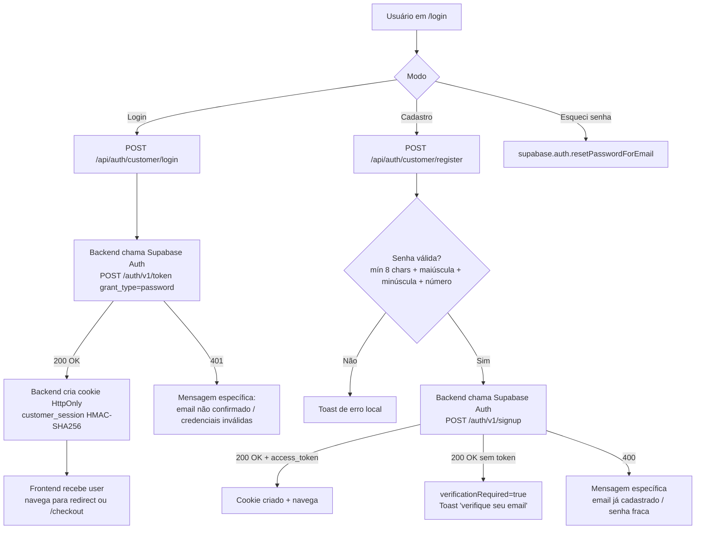
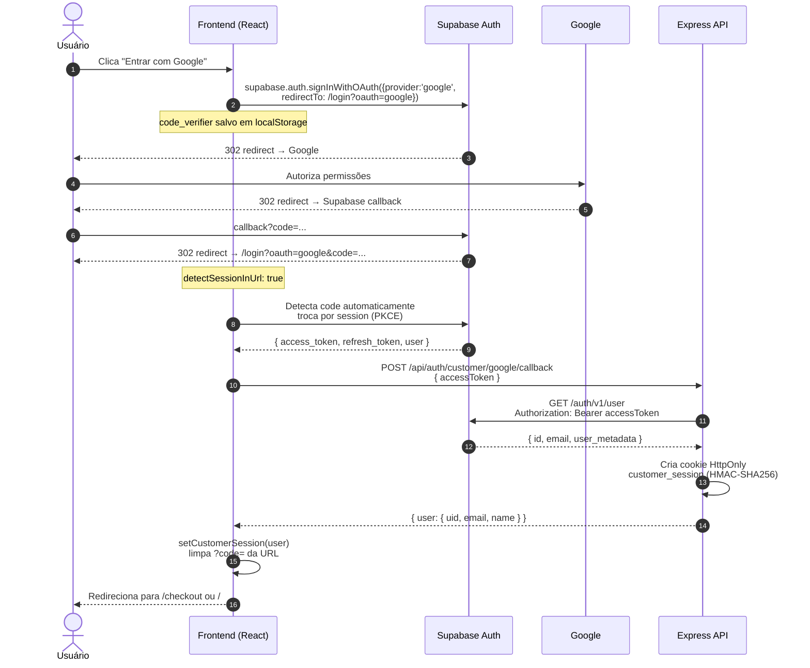
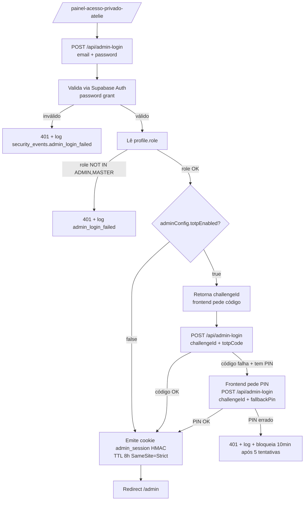
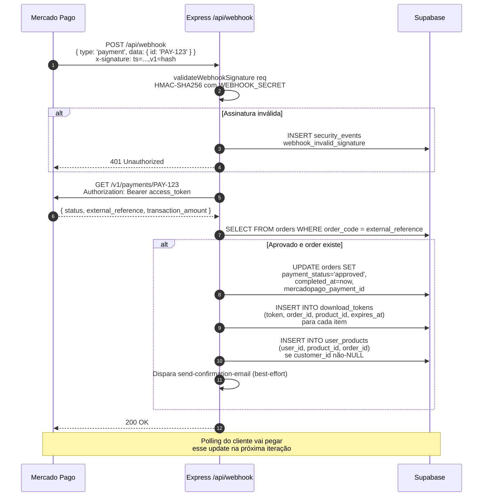
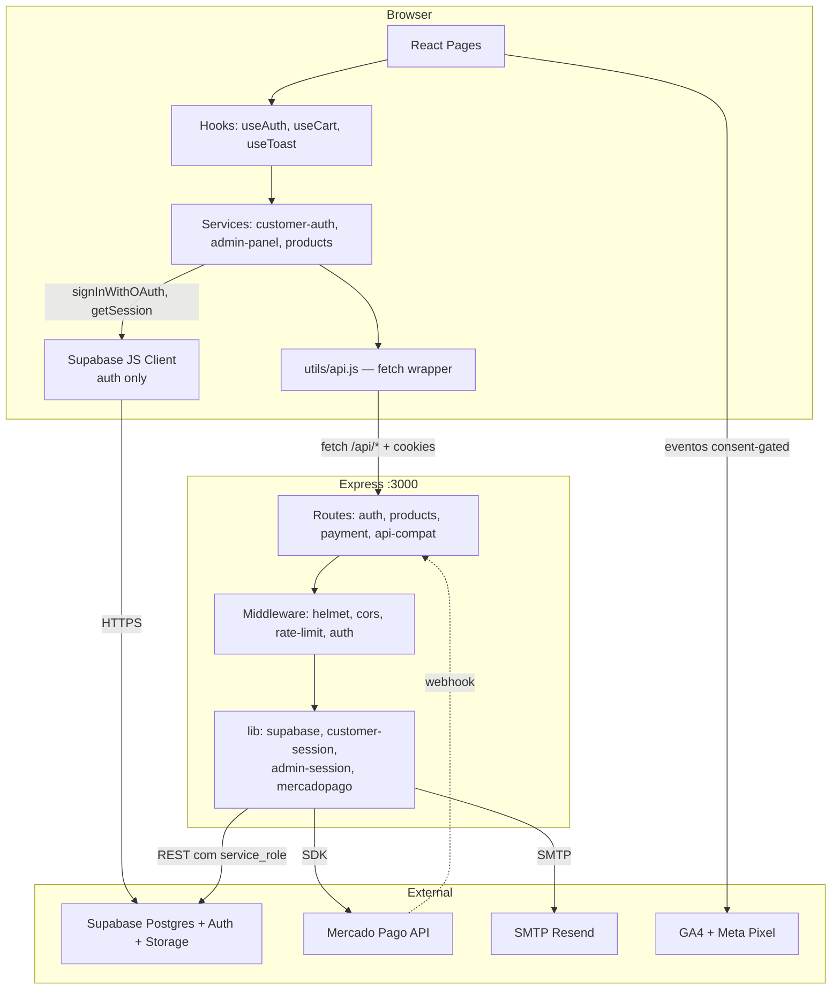

# 05 — Fluxos (diagramas)

> Diagramas em **Mermaid**. Abra este arquivo no GitHub, VS Code (com extensão Mermaid Preview) ou em https://mermaid.live.

## Índice

1. [Cadastro e login de cliente (e-mail/senha)](#1-cadastro-e-login-de-cliente-e-mailsenha)
2. [Login com Google OAuth (PKCE)](#2-login-com-google-oauth-pkce)
3. [Reset de senha](#3-reset-de-senha)
4. [Login do admin (com 2FA)](#4-login-do-admin-com-2fa)
5. [Compra e download](#5-compra-e-download)
6. [Webhook Mercado Pago](#6-webhook-mercado-pago)
7. [Admin: criar / editar produto](#7-admin-criar--editar-produto)
8. [Carrinho abandonado e reativação](#8-carrinho-abandonado-e-reativação)
9. [Inscrição em newsletter (double opt-in)](#9-inscrição-em-newsletter-double-opt-in)
10. [Estrutura geral de chamadas](#10-estrutura-geral-de-chamadas)

---

## 1. Cadastro e login de cliente (e-mail/senha)



**Pontos:**
- A política de senha é validada **no client e no backend** (defense in depth).
- O cookie HttpOnly do nosso backend é **separado** da sessão do Supabase Client.
- "verificationRequired" depende do toggle "Confirm email" no Supabase Auth.

---

## 2. Login com Google OAuth (PKCE)



**Pontos críticos:**
- O **Supabase Client é o único responsável** pelo OAuth — não fazemos a request pro Google manualmente.
- O `redirectTo` precisa estar no `uri_allow_list` do Supabase (`scripts/configure-auth.js` cuida disso).
- O cookie HttpOnly do nosso backend é **separado** da sessão do Supabase Client. Os dois coexistem.
- `code_verifier` (PKCE) protege contra interceptação do `code` por extensões maliciosas.

---

## 3. Reset de senha

```mermaid
flowchart TD
    A[Usuário em /login → 'Esqueci minha senha'] --> B[supabase.auth.resetPasswordForEmail<br/>email + redirectTo=/reset-password]
    B --> C[Supabase Auth → SMTP Resend<br/>envia e-mail com link<br/>https://app.com/reset-password?code=...]
    C --> D[Usuário clica no link]
    D --> E[ResetPasswordPage carrega]
    E --> F[supabase.auth.exchangeCodeForSession code]
    F -->|sucesso| G[Form: nova senha + confirmação]
    F -->|erro / expirado| H[Erro: peça novo link]
    G --> I[supabase.auth.updateUser { password }]
    I -->|sucesso| J[Toast 'senha atualizada' + redirect /login]
    I -->|fraca| K[Toast erro: política de senha]
```

**Pré-requisitos para o reset funcionar:**
- SMTP custom configurado no Supabase Auth (sem isso, usa SMTP grátis que só entrega pra members da org).
- Em sandbox do Resend, só entrega para o e-mail dono da conta Resend.
- Em produção: domínio verificado em [resend.com/domains](https://resend.com/domains) + `smtp_admin_email` apontando pra ele.

---

## 4. Login do admin (com 2FA)



**Notas:**
- Rate-limit em `/admin-login`: **5 tentativas falhas / 10 min** (`skipSuccessfulRequests: true`).
- `totpSecret` e `fallbackPin` (hash bcrypt) ficam em `settings.adminConfig` (RLS service-only).
- TOTP usa janelas de ±1 (30s antes/depois) para tolerar drift de clock.
- Falha de login **sempre** gera `security_events.admin_login_failed` com IP + UA + email hash.

---

## 5. Compra e download

```mermaid
flowchart TD
    A[Cliente adiciona ao carrinho<br/>localStorage] --> B[/checkout/]
    B --> C[Preenche nome + email<br/>cupom opcional]
    C --> D[POST /api/create-payment<br/>{ items, customer, coupon }]

    D --> D1[Backend valida produtos<br/>SELECT FROM products WHERE id IN ...]
    D1 --> D1a[Re-calcula total<br/>aplica cupom se válido]
    D1a --> D2[INSERT INTO orders + order_items<br/>status=pending, order_code 128bits]
    D2 --> D3[Cria preferência Mercado Pago<br/>com items + back_urls + notification_url]
    D3 --> D4[UPDATE orders SET preference_id]
    D4 --> D5{Retorna initPoint para o frontend}

    D5 --> E[Frontend abre Mercado Pago<br/>em nova aba via window.open]
    D5 --> F[Salva pendingOrderId no state<br/>useEffect inicia polling]

    F --> F1[A cada 4s: GET /api/verify-payment?orderId=X&email=Y]
    F1 --> F2{paymentStatus?}
    F2 -->|approved| G[Limpa carrinho + dispara purchase event<br/>navega para /downloads]
    F2 -->|rejected/cancelled| H[Toast erro + polling para]
    F2 -->|pending| F1
    F2 -->|150x sem resposta| I[Timeout 10min<br/>usuário pode verificar em Downloads depois]

    G --> J[/downloads?order=X/]
    J --> J1[GET /api/verify-payment?orderId=X&email=Y]
    J1 --> J2{Status approved?}
    J2 -->|Sim| K[Lista download_tokens]
    J2 -->|Não| L[Continua polling a cada 10s<br/>até max 12 tentativas]

    K --> M[Para cada arquivo:<br/>href = /api/download?token=Y]
    M --> N[Backend valida token<br/>gera signed URL Supabase Storage<br/>faz pipe arquivo→browser]
    N --> O[INSERT INTO download_logs<br/>marca token como used]

    G -.->|paralelo| P[POST /api/send-confirmation-email<br/>nodemailer → Resend]
    P --> Q[Email transacional<br/>'Pagamento confirmado']
```

**Webhook paralelo:** ver fluxo #6. Polling cobre o caso de webhook não chegar (dev sem ngrok, lag em prod).

**Email de confirmação:** se `SMTP_HOST/USER/PASS` não estiverem no `.env.local`, o backend loga warning e segue (não falha checkout).

---

## 6. Webhook Mercado Pago



**Idempotência:** o handler é seguro a múltiplas chamadas com o mesmo `paymentId`. Re-emitir download_tokens não duplica porque o backend verifica se já existe `user_products` para o par (user, product, order).

**Em dev sem ngrok**: webhook nunca chega → polling no frontend cobre o gap.

---

## 7. Admin: criar / editar produto

```mermaid
flowchart LR
    A[Admin em /admin] --> B[Tab Produtos]
    B --> C[Clica 'Novo produto'<br/>OU 'Editar' em existente]
    C --> D[ProductWizard abre - ModalWizard]

    D --> D1[Step 1: Básico<br/>nome + categoria + descrição + tags]
    D1 --> D2[Step 2: Mídia<br/>multi-images + multi-videos + downloadUrl]
    D2 --> D3[Step 3: Preço<br/>price + originalPrice + product_type + is_kit]
    D3 --> E[Submit do form]

    E --> F[AdminPage.handleProductSave<br/>monta payload com images[] e videos[]]
    F --> G{Tem ID?}
    G -->|Sim| H[PUT /api/admin-products<br/>updateProduct]
    G -->|Não| I[POST /api/admin-products<br/>createProduct]

    H --> J[Backend valida sessão admin<br/>ensureAdminSession]
    I --> J
    J --> K[toProductPayload normaliza<br/>image_url = images[0]<br/>images: jsonb array<br/>videos: jsonb array<br/>slug gerado automaticamente]
    K --> L[INSERT/UPDATE em public.products]
    L --> M[Refresh dashboard<br/>fechar wizard<br/>toast sucesso]
```

> ⚠️ Editar `faq`, `reviews` e `benefits` ainda é feito por SQL direto — wizard pendente. Ver [13-ROADMAP §3.4](./13-ROADMAP-PENDENCIAS.md).

---

## 8. Carrinho abandonado e reativação

```mermaid
flowchart TD
    A[Cliente preenche email no checkout] --> B[POST /api/abandoned-cart<br/>{ email, items, total, attribution }]
    B --> C[INSERT INTO abandoned_carts<br/>session_id único]

    A2[Cliente finaliza compra<br/>na mesma sessão] -.->|UPDATE recovered_at=now| C

    D[GitHub Actions cron de hora em hora] --> E[POST /api/cron-email-jobs<br/>Authorization: Bearer CRON_SECRET]
    E --> F[SELECT abandoned_carts<br/>WHERE recovered_at IS NULL<br/>AND reminder_sent_at IS NULL<br/>AND created_at > now - 24h]
    F --> G[Para cada cart:<br/>enviar email 'esqueceu algo?'<br/>com link de retorno ao checkout]
    G --> H[UPDATE reminder_sent_at = now<br/>INSERT email_sent_log]

    I[Cron diário] --> J[Reativação 90d<br/>SELECT clientes último pedido<br/>entre 90 e 180 dias]
    J --> K[Enviar email 'sentimos sua falta'<br/>com cupom VOLTEI15]
    K --> L[INSERT email_sent_log<br/>campaign=reactivation_90d]
```

**Regras (ver [11-REGRAS-NEGOCIO §D](./11-REGRAS-NEGOCIO.md)):**
- D2: link de descadastro 1-clique em **todo** e-mail.
- D7: não enviar para inativos > 180 dias.
- D8: cupom de reativação só para a janela 90-180d (evitar dar desconto a quem ia comprar).

---

## 9. Inscrição em newsletter (double opt-in)

```mermaid
flowchart TD
    A[NewsletterSignup form<br/>footer ou popup] --> B[POST /api/subscribe<br/>{ email, source }]
    B --> C{Já existe?}
    C -->|status=confirmed| C1[Resposta 'já inscrito'<br/>idempotente]
    C -->|status=unsubscribed| C2[Reativa: status=pending<br/>novo confirmation_token]
    C -->|não existe| C3[INSERT email_subscribers<br/>status=pending<br/>confirmation_token]
    C2 --> D
    C3 --> D[Envio de email de confirmação<br/>link /confirmar-inscricao?token=XYZ]

    E[Cliente clica no link] --> F[GET /api/confirm-subscription?token=XYZ]
    F --> G{Token válido?}
    G -->|Sim| H[UPDATE status='confirmed'<br/>confirmed_at=now]
    G -->|Não/expirado| I[Página de erro<br/>'link expirado, peça novo']

    J[Cliente clica 'descadastrar' em qualquer email] --> K[GET /api/unsubscribe?token=XYZ]
    K --> L[UPDATE status='unsubscribed'<br/>unsubscribed_at=now]
    L --> M[Página de confirmação<br/>'você foi descadastrado']
```

**Idempotência:** mesmo email enviado várias vezes não cria duplicatas. Mesmo token de unsubscribe pode ser clicado múltiplas vezes sem erro.

---

## 10. Estrutura geral de chamadas



**Observações:**
- O **Express é BFF** (Backend for Frontend): browser não fala direto com Supabase para dados (só Auth).
- **Service role nunca sai do servidor** — fica em variáveis de env do backend.
- **`utils/api.js`** centraliza fetch, timeout (15s) e parsing de erro.
- **Supabase JS Client no browser**: usado **apenas** para `signInWithOAuth`, `signOut`, `getSession`, `updateUser` (reset de senha), `exchangeCodeForSession`. Toda CRUD em tabelas vai via backend.
- **GA4/Pixel** só disparam após `consent.granted === true` (ver `utils/consent.js` + `ConsentBanner.jsx`).
